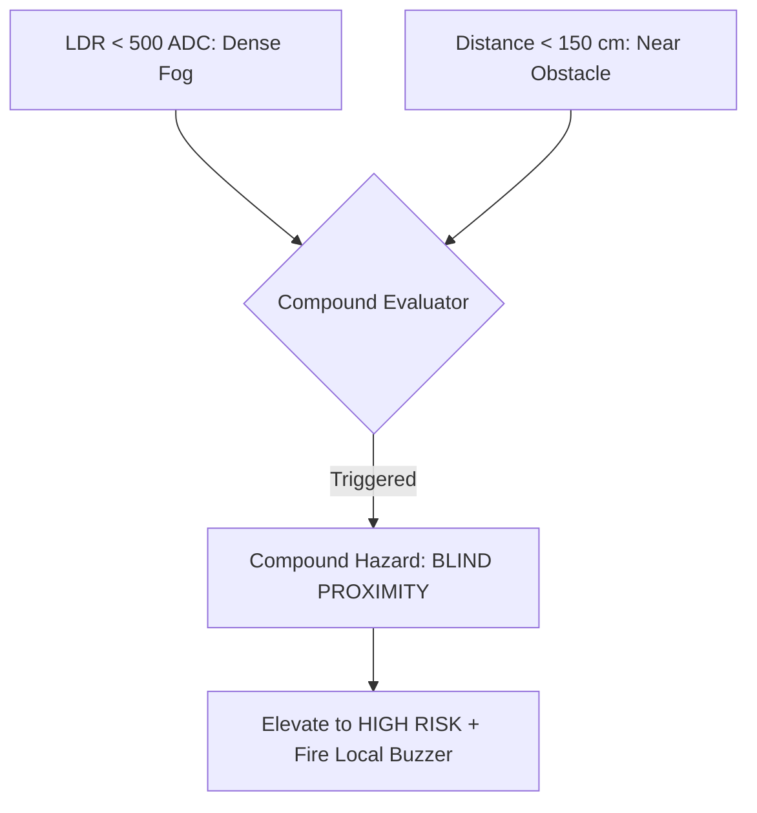

# DEEPFOG — Sensor-Fusion Risk Engine Specification

This document details the multi-sensor fusion rationale, weighted scoring formulas, compound hazard rules, and prototype thresholds implemented in the **DEEPFOG Intelligent Mine Vehicle Safety System**.

---

## Why Sensor Fusion?

In open-cast iron ore mining operations, relying on a single sensor leads to severe blind spots and hazardous false alarms:

1. **Fog vs. Darkness vs. Dust**:
   - An ambient light sensor (LDR) cannot differentiate between nighttime darkness, dense water fog, or an iron ore dust plume caused by blasting.
   - By fusing **LDR + DHT11 (Humidity) + MQ-2 (Gas/Particulate)**, the system accurately detects:
     - *High Humidity (>85%) + Low LDR*: **Dense Water Fog Inversion**
     - *Low Humidity (<40%) + High Gas/Smoke + Low LDR*: **Heavy Blast Dust Cloud / Toxic Fumes**

2. **Road Bump vs. Structural Collision**:
   - A single accelerometer spike can be triggered by a common pothole on a haul road.
   - By fusing **MPU-6050 (Acceleration) + SW-420 (Vibration) + HC-SR04 (Ultrasonic Distance)**:
     - *High Accel + Low Distance (<1m)*: **High-probability vehicle or berm collision**
     - *High Accel + High Vibration + Clear Distance*: **Haul road surface degradation / pothole impact**

3. **Bench Wall Collapse & Rollover**:
   - By fusing **MPU-6050 (Tilt Angle) + SW-420 (Vibration Intensity)**:
     - *Tilt > 15° + High Vibration*: **Vehicle operating near bench edge with structural ground instability**

---

## Sensor Weighting & Scoring Formula

The risk score is a composite index ranging from `0` (Completely Safe) to `100` (Imminent Hazard):

$$ \text{Risk Score} = \min\left(100, \sum_{i=1}^{n} W_i \cdot S_i + \text{Compound Penalties}\right) $$

| Parameter | Sensor | Baseline Range | Warning Threshold | Danger Threshold | Max Weight ($W_i$) |
|---|---|---|---|---|---|
| **Visibility** | LDR ADC | 2000 – 4095 | < 1500 (Moderate) | < 500 (Dense Fog) | **25 pts** |
| **Proximity** | HC-SR04 (cm) | > 300 cm | < 250 cm | < 100 cm | **30 pts** |
| **Gas / Fumes** | MQ-2 ADC | 100 – 350 | > 400 | > 700 | **25 pts** |
| **Vehicle Tilt** | MPU-6050 (deg) | 0 – 10° | > 15° | > 28° | **25 pts** |
| **Vibration** | SW-420 (norm) | 0.05 – 0.3 | > 0.45 | > 0.80 | **15 pts** |
| **Acceleration** | MPU-6050 (g) | 0.9 – 1.2 g | > 2.5 g | > 4.0 g | **20 pts** |

---

## Compound Risk Scenarios

The engine applies synergistic compound bonuses when multiple hazardous conditions occur concurrently:

1. **Blind Proximity Hazard**:
   - Condition: `light_level < 500` AND `distance < 150 cm`
   - Action: Adds `+20` compound penalty; forces risk level immediately to **`HIGH`**.
   - Driver Message: *"Low visibility combined with near obstacle. Reduce speed immediately!"*

2. **Toxic Fog Inversion**:
   - Condition: `humidity > 85%` AND `gas_level > 550`
   - Action: Adds `+15` compound penalty; warns of toxic particulate trapping.
   - Driver Message: *"Exhaust fumes trapped by surface atmospheric inversion."*

3. **Ground Instability / Edge Hazard**:
   - Condition: `tilt > 15°` AND `vibration_intensity > 0.75`
   - Action: Adds `+20` compound penalty; alerts control room to bench edge collapse risk.

---

## Risk Level Classification

- **`LOW` (Score 0 – 39)**:
  - All sensors reporting within standard operating margins.
  - Web UI: Emerald green badges.
  - In-Cab: Silent, normal telemetry on OLED.

- **`MEDIUM` (Score 40 – 69)**:
  - Moderate fog, slightly elevated dust, or rough haul road detected.
  - Web UI: Amber badges and warnings logged to Alerts feed.
  - In-Cab: Intermittent short beep every 4 seconds.

- **`HIGH` (Score 70 – 100)**:
  - Severe fog, imminent obstacle, rollover angle, or toxic fume accumulation.
  - Web UI: Flashing red warning hero, persistent emergency banner.
  - In-Cab: Continuous audible buzzer alarm and flashing OLED risk screen.
